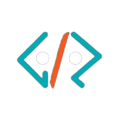

# 🚀 Geek Room KIET

<div align="center">



</div>

---

## 📖 About

**Geek Room KIET** is the official website for the Geek Room chapter at KIET (Krishna Institute of Engineering and Technology). We're a passionate community of students dedicated to fostering a dynamic tech culture through interdisciplinary learning, hands-on workshops, coding sessions, and collaborative projects.

### 🎯 Our Mission
- **Empower students** to sharpen their technical expertise
- **Explore cutting-edge technologies** and build innovative projects
- **Foster collaboration** through workshops, competitions, and team projects
- **Create a supportive space** for students to connect, learn, and make a lasting impact

---

## ✨ Features

### 🏠 **Homepage**
- **Splash Screen**: Eye-catching animated introduction
- **Why Join Us**: Compelling reasons to join our community
- **Statistics**: Live member count and event statistics
- **Gallery Carousel**: Showcase of past events and activities
- **Team Structure**: Interactive team cards with smooth animations
- **Contact Form**: Easy way to get in touch with us

### 🎨 **Design & UX**
- **Modern UI**: Clean, professional design with dark theme
- **Responsive**: Optimized for all devices (mobile, tablet, desktop)
- **Smooth Animations**: CSS-based animations for better performance
- **Accessibility**: Built with accessibility best practices
- **Fast Loading**: Optimized for speed and performance

### 🛠 **Technical Features**
- **Next.js 15**: Latest React framework with App Router
- **TypeScript**: Type-safe development
- **Tailwind CSS**: Utility-first CSS framework
- **GSAP Animations**: Smooth, performant animations
- **Form Handling**: React Hook Form with validation
- **Image Optimization**: Next.js Image component for optimal loading

---

## 🚀 Quick Start

### Prerequisites
- **Node.js** 18.0 or later
- **Bun** (recommended) or npm/yarn/pnpm

### Installation

1. **Clone the repository**
   ```bash
   git clone https://github.com/your-username/geekroom-kiet.git
   cd geekroom-kiet
   ```

2. **Install dependencies**
   ```bash
   # Using Bun (recommended)
   bun install
   
   # Or using npm
   npm install
   
   # Or using yarn
   yarn install
   ```

3. **Start the development server**
   ```bash
   # Using Bun
   bun run dev
   
   # Or using npm
   npm run dev
   
   # Or using yarn
   yarn dev
   ```

4. **Open your browser**
   Navigate to [http://localhost:3000](http://localhost:3000) to see the website.

---

## 📁 Project Structure

```
geekroom-kiet/
├── public/                 # Static assets
│   ├── logo.png           # Main logo
│   ├── *.jpg              # Gallery images
│   └── *.png              # Team member photos
├── src/
│   ├── app/               # Next.js App Router
│   │   ├── globals.css    # Global styles
│   │   ├── layout.tsx     # Root layout
│   │   ├── page.tsx       # Homepage
│   │   ├── blogs/         # Blog pages
│   │   ├── events/        # Events pages
│   │   ├── gallery/       # Gallery pages
│   │   ├── join-us/       # Join us page
│   │   ├── projects/      # Projects pages
│   │   └── team/          # Team pages
│   ├── components/        # React components
│   │   ├── ui/            # Reusable UI components
│   │   ├── ContactSection.tsx
│   │   ├── Footer.tsx
│   │   ├── Gallery.tsx
│   │   ├── Navbar.tsx
│   │   └── WhyJoinUsSection.tsx
│   └── lib/               # Utility functions
│       └── utils.ts
├── CONTRIBUTING.md        # Contribution guidelines
├── package.json           # Dependencies and scripts
├── tailwind.config.ts     # Tailwind configuration
├── tsconfig.json          # TypeScript configuration
└── next.config.js         # Next.js configuration
```

---
## 🎨 Tech Stack

### **Frontend**
- **Framework**: Next.js 15.2.0 with App Router
- **Language**: TypeScript 5.0
- **Styling**: Tailwind CSS 3.4.1
- **UI Components**: Radix UI primitives
- **Icons**: Lucide React
- **Animations**: GSAP 3.12.7
- **Forms**: React Hook Form with Zod validation

### **Development Tools**
- **Package Manager**: Bun (with npm/yarn support)
- **Linting**: Biome (ESLint alternative)
- **Type Checking**: TypeScript
- **Code Formatting**: Biome formatter

### **Deployment**
- **Platform**: Vercel (recommended)
- **Static Export**: Supported for other platforms

---

## 🤝 Contributing

We welcome contributions from the community! Please read our [Contributing Guide](CONTRIBUTING.md) before getting started.

### **How to Contribute**
1. Fork the repository
2. Create a feature branch (`git checkout -b feat/amazing-feature`)
3. Make your changes
4. Commit your changes (`git commit -m 'Add amazing feature'`)
5. Push to the branch (`git push origin feat/amazing-feature`)
6. Open a Pull Request

### **Development Guidelines**
- Follow the existing code style
- Write clear commit messages
- Test your changes locally
- Update documentation if needed
- Be respectful and collaborative

---

## 🙏 Acknowledgments

- **Geek Room Global** for the inspiration and community support
- **KIET** for providing the platform for our tech community
- **All Contributors** who help make this project better
- **Open Source Community** for the amazing tools and libraries

---

<div align="center">

**Made with ❤️ by Geek Room KIET**

</div>